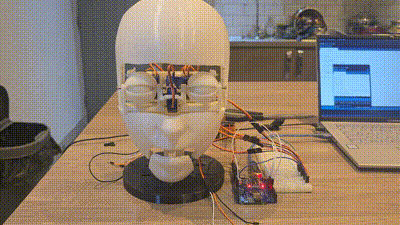

Animatronic Robot Head: Dual Eye Mechanism with Movable Mouth

Overview

This project showcases my work as an MSc Robotics graduate, where I built a 3D-printed animatronic robot head with articulated eyes and a movable mouth. Using 6 servo motors controlled via an Arduino, this mechanism brings the robot's face to life with smooth, realistic motion.

The eyes are based on a simplified dual-eye mechanism that I adapted and further customized, inspired by the amazing work of the author on Instructables. My design incorporates:

3D-printed parts for the eyes and face using the Creality Neo Max printer.
A servo-driven mouth movement mechanism designed and integrated by me.

Features
Dual Eye Mechanism:
Coordinated movement of the eyes using four servos, enabling natural motion.
Independent Mouth Mechanism:
A servo dedicated to mouth movement, paving the way for future lip-syncing functionality.
Arduino-Powered Control System:
Simple and efficient control of servo motors using Arduino programming.

How It Works
Hardware Components
Servo Motors (x6): Control eye and mouth movements.
Arduino Board: Serves as the controller for all servos.
3D-Printed Parts:
Eye parts and face designed and printed using the Creality Neo Max.
Mouth mechanism customized and integrated into the design.
Software Implementation
The servos are programmed to:

Move the eyes in a synchronized but natural pattern.
Simulate basic mouth movement.

Currently in Progress:
1) Human Detection:
Adding a camera and sensors to make the robot head respond to humans.
2) Voice Interaction:
Syncing the mouth mechanism with audio output to create talking animations.

Special shoutout to the makers and robotics community for continuous inspiration.
Stay Tuned for More!
This project is part of a broader journey to create lifelike robotics. I’m working on implementing advanced features like human detection, voice interaction, and complex facial expressions. Follow this repository to stay updated on the latest developments.
